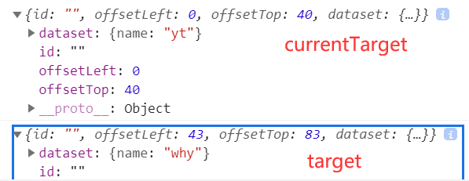

### 1.点击事件

```html
<button bindtap="onClick">点击事件</button>
```

```js
Page({ onClick(event) { console.log("点击事件", event) }})
```

### 2.target和currentTarget

```html
<view class="outer" bindtap="outerClick" data-name="yt">
  <view class="inner" data-name="why"></view>
</view>
```

```js
outerClick(event) {
  console.log(event.currentTarget);
  console.log(event.target);
}
```



### 3.捕获和冒泡

```html
<view class="outer" capture-bind:tap="outerClick1" bindtap="outerClick2">
  <view class="inner" capture-bind:tap="innerClick1" catchtap="innerClick2"></view>
</view>
```

- capture-catch:tap：阻止捕获
- catchtap：阻止冒泡

### 4.mark

```html
<view mark:name="yt" bindtap="markClick">
  <text mark:age="22">123</text>
</view>
```

```js
markClick(event) { console.log(event) }
```

