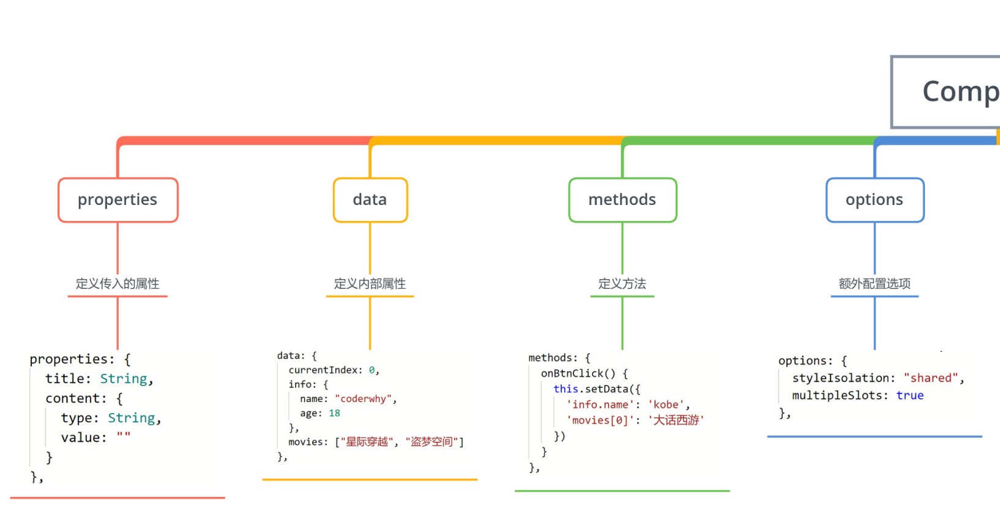
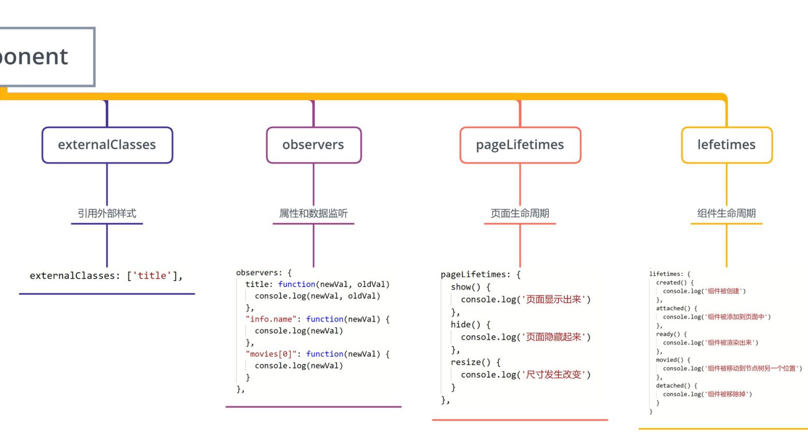

### 1.单个插槽

- 页面

  ```html
  <my-slot>
    <button>123</button>
  </my-slot>
  
  <my-slot></my-slot>
  ```

- 组件

  ```html
  <view class="slot">
    <slot></slot>
  </view>
  <view class="default">默认内容</view>
  ```

  ```css
  .default { display: none }
  .slot:empty + .default { display: block }
  ```

### 2.多个插槽

- 页面

  ```html
  <mul-slot>
    <button slot="left">left</button>
    <view slot="center">123</view>
    <text slot="right">abc</text>
  </mul-slot>
  ```

- 组件

  ```js
  Component({options: { multipleSlots: true }})
  ```

  ```html
  <view class="mul-slot">
    <view class="left">
      <slot name="left"></slot>
    </view>
    <view class="center">
      <slot name="center"></slot>
    </view>
    <view class="right">
      <slot name="right"></slot>
    </view>
  </view>
  ```

### 3.组件的混入

- 页面

  ```html
  <behavior></behavior>
  ```

  ```json
  {"usingComponents": {"behavior": "/components/06behavior/behavior"}}
  ```

- 组件

  ```js
  import { counterBehavior } from "../../behaviors/counter"
  
  Component({ behaviors: [counterBehavior] })
  ```

  ```html
  <view>{{counter}}</view>
  <button bindtap="increment">+1</button>
  <button bindtap="decrement">-1</button>
  ```

- 混入

  ```js
  export const counterBehavior = Behavior({
    data: { counter: 100 },
    methods: {
      increment() {this.setData({ counter: this.data.counter + 1 })},
      decrement() {this.setData({ counter: this.data.counter - 1 })}
    }
  })
  ```

### 4.组件的生命周期

```js
Component({
  lifetimes: {
    created() { console.log("组件被创建created") },
    attached() { console.log("组件被添加到组件树中attached") },
    detached() { console.log("组件从组件树中被移除detached") }
  },
  pageLifetimes: {
    show() { console.log("page show") },
    hide() { console.log("page hide") }
  }
})
```

### 5.小总结



